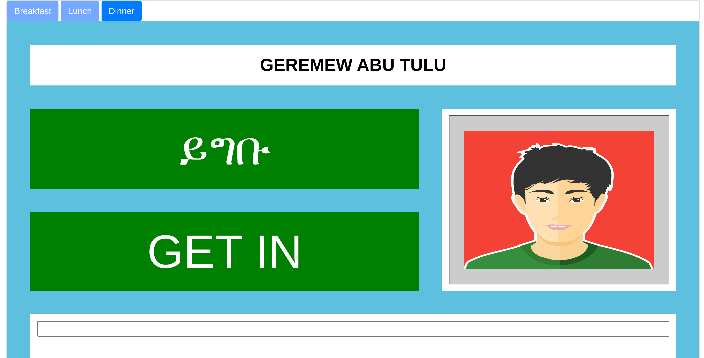

<a href="public/img/Student-Cafe-Dining-Management-System-Demo.mp4"/>

 

## Student Cafe Web Application
Student Cafe is a University cafeteria management system. The University provides foods three times a day. 
The system has three schedules a day. Breakfast, Lunch and Dinner. 
The system tells if Unknown ID is used and if a student attempts to use the card more than one time per schedule.
It also has more functionalities. 

## Steps of Installation

- git clone https://github.com/AmsaluGit/student_cafe.git
- cd student_cafe
- update .env according to your database credentials
- composer install
- create database 'student_cafe' in your local machine.
- import the student_cafe.sql into your database
- open terminal and run 'symfony server:start -d'
- go to http://127.0.0.1:8000 as shown in your terminal.

## How to use the system
- Login with username = admin and password = 123456
- Under 'student information' click on 'scanning'.
- Open students_list.pdf file from the project root directory.
- From the file, copy barcode from the barcode column and paste on the text box of the system and hit enter.
- You can try for other students as well.
- Try for the same ID more than one time, or with invalid Id.
- video https://www.loom.com/share/63c71cceaa4d490ebdc659f949afcf32
